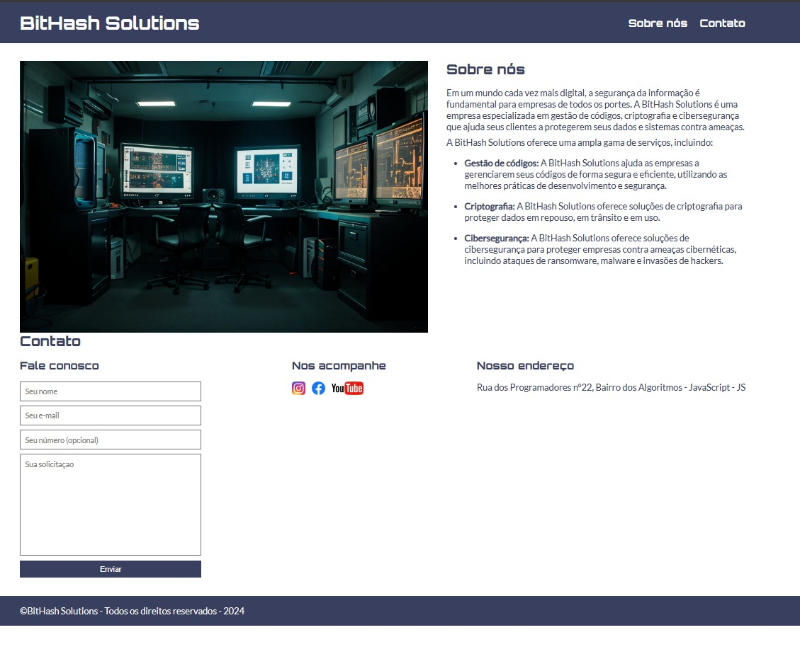

# SITE BitHash Solutions

## Exercise

  

Repositório destinado a compartilhar o desenvolvimento inicial de **HTML** e **CSS** em meus estudos na plataforma **EBAC**, utilizando a IDE **VS_CODE**, usando o percurso de ensino da plataforma.

VERCEL -> https://site-bit-hash-solutions.vercel.app/

  
___

  

# Autor

| [ Ruannino Farias](https://github.com/ruannino) 
| :---: |
